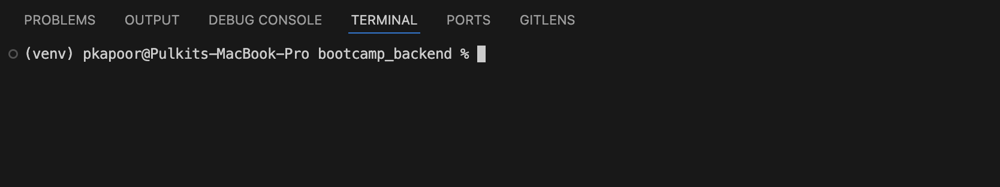

# Interneers Lab

Welcome to the **Interneers Lab 2025** repository! This serves as a minimal starter kit for learning and experimenting with:
- **Django** (Python)
- **React**  (with TypeScript)
- **MongoDB** (via Docker Compose)
- Development environment in **VSCode** (recommended)

**Important:** Use the **same email** you shared during onboarding when configuring Git and related tools. That ensures consistency across all internal systems.


---

## Table of Contents

1. [Getting Started with Git & Forking](#getting-started-with-git-and-forking)
2. [Prerequisites & Tooling](#prerequisites--tooling)
3. [Setting Up the Project](#setting-up-the-project)
4. [Running Services](#running-services)
   - [Backend: Django](#backend-django)
   - [Database: MongoDB via Docker Compose](#database-mongodb-via-docker-compose)
5. [Verification of Installation](#verification-of-installation)
6. [Development Workflow](#development-workflow)
   - [Recommended VSCode Extensions](#recommended-vscode-extensions)
   - [Making Changes & Verifying](#making-changes--verifying)
   - [Pushing Your First Change](#pushing-your-first-change)
7. [Making your first change and running it](#making-your-first-change)
   - [Backend](#backend)
      - [Starter 0](#starter-0-changes)
      - [Starter 1](#starter-1-changes)
8. [Running Tests (Optional)](#running-tests-optional)
9. [Frontend Setup](#frontend-setup)
10. [Further Reading](#further-reading)

---

## Getting Started with Git and Forking

### 1. Setting up Git and the Repo

1. **Install Git** (if not already):
   - **macOS**: [Homebrew](https://brew.sh/) users can run `brew install git`.
   - **Windows**: Use [Git for Windows](https://gitforwindows.org/).
   - **Linux**: Install via your distro’s package manager, e.g., `sudo apt-get install git` (Ubuntu/Debian).

2. **Configure Git** with your name and email:
   ```bash
   git config --global user.name "Your Name"
   git config --global user.email "your.email@example.com" # Use the same email you shared during onboarding
3. What is Forking?

   Forking a repository on GitHub creates your own copy under your GitHub account, where you can make changes independently without affecting the original repo. Later, you can make pull requests to merge changes back if needed.

4. Fork the Rippling/interneers-lab repository (ensure you’re in the correct org or your personal GitHub account, as directed).
5. **Clone** your forked repo:
    ```
    git clone git@github.com:<YourUsername>/interneers-lab.git
    cd interneers-lab
    ```

## Prerequisites & Tooling

These are the essential tools you need:

1. **Homebrew (macOS Only)**

   **Why?** 
   
   Homebrew is a popular package manager for macOS, making it easy to install and update software (like Python, Node, Yarn, etc.).
   
   **Install**:  
   ```bash
   /bin/bash -c "$(curl -fsSL https://raw.githubusercontent.com/Homebrew/install/HEAD/install.sh)"

2. **Python 3.13** (if you need Python scripts or a backend environment)
   - **Why 3.13?**

      This is the recommended version for the module’s Python-related tasks, ensuring consistency across projects.
   - **Install or Upgrade**:  
     
     - macOS (with Homebrew): `brew install python`  
     - Windows: [Download from python.org](https://www.python.org/downloads/) (ensure it’s 3.13)  
   - **Verify**:
     
     ```bash
     python3 --version
     ```
     You should see something like `Python 3.13.x`.

   If you are getting something else , please update `.bashrc` or `.zshrc` to have alias with following
   ```
   vim ~/.zshrc   # or any preferred editor of your choice
   alias python3 = "/opt/homebrew/bin/python3.13"
   :wq      # save the file with any equivalent command
   source ~/.zshrc # or ~/.bashrc
   ```

3. **virtualenv** or built-in `venv`  

   **Why?**
   
   A virtual environment keeps project dependencies isolated from your system Python.

   **Install**
   - `pip3 install virtualenv` (if needed)  
   - or use `python3 -m venv venv`

   **Tutorial**
   Refer to the [Virtualenv Tutorial](https://www.youtube.com/watch?v=eDe-z2Qy9x4) to learn more about why virtual environments matter.

   **Verify**
   
   - Try to activate the venv using the following command
      ```
      source venv/bin/activate         # macOS/Linux
      .\venv\Scripts\activate          # Windows
      ```

   - In most of the machines, your terminal prompt will be prefixed with something like (venv) (or whatever you named the virtual environment).

      

   Check Which Python Is Being Used:

   1. macOS/Linux
      
      ```which python```

      This should return a path inside the venv/ directory (e.g., .../my-project/venv/bin/python
   
   2. Windows

      ```where python```

      This should return a path inside `venv\Scripts\python.exe`.
   

4. **Docker** & **Docker Compose**  

   **Why**

   We use Docker to run MongoDB (and potentially other services) in containers, preventing “works on my machine” issues.

   **Install**

   - [Docker Desktop for Mac](https://www.docker.com/products/docker-desktop/)  
   - [Docker Desktop for Windows](https://www.docker.com/products/docker-desktop/)  
   
   **Verify**
   
   Verify verison and successfull installation with `docker --version` and `docker compose version`


5. **Node.js** & **Yarn**  
   
   **Why?**

   We use React.js for our frontend, which requires Node.js. Yarn is a popular package manager for Node.

   **Install**

   - [Node.js Downloads](https://nodejs.org/en/download/)  
   - [Yarn Install Docs](https://classic.yarnpkg.com/lang/en/docs/install/)  

   **Verify**
   - Check version and installation completion with `node --version` and `yarn --version` 

6. **API & MongoDB Tools**  
   - **[Postman](https://www.postman.com/downloads/)**, **[Insomnia](https://insomnia.rest/download)**, or **[Paw](https://paw.cloud/client) (only for mac)** for API testing  
   - **[MongoDB Compass](https://www.mongodb.com/try/download/compass)** or a **[VSCode MongoDB](https://code.visualstudio.com/docs/azure/mongodb)** extension

## Setting Up the Project

### Create a Python Virtual Environment

The python virtual env should be created inside the backend directory. Run the following commands inside the `backend` directory to create virtual environment.
```bash
cd backend
python3.13 -m venv venv
```
To activate the virtual environment, run the following command:
```bash
# macOS/Linux
source venv/bin/activate
```
```Powershell
# on Windows Powershell:
Set-ExecutionPolicy RemoteSigned -Scope CurrentUser
.\venv\Scripts\activate
```

### Install Python Dependencies

```bash
pip3 install -r requirements.txt
```

By default, **requirements.txt** includes:
- **Django**
- **pymongo** (MongoDB driver)


**Check your `.gitignore`**  
Make sure `venv/` and other temporary files aren’t committed.

---

## Running Services

### Backend: Django

If your Django project is in `backend`, navigate there:

```bash
cd backend
```

Start the Django server on a port less likely to conflict (e.g., `8001`):

```bash
python manage.py runserver 8001
```

Open [http://127.0.0.1:8001/hello/](http://127.0.0.1:8001/hello/) to see the **"Hello World"** endpoint.

---

### Database: MongoDB via Docker Compose

In the project root, you’ll find (or create) a `docker-compose.yaml`.

To start MongoDB via Docker Compose:

```bash
docker compose up -d
```

Verify with:

```bash
docker compose ps
```

MongoDB is now running on `localhost:27018`. Connect using `root` / `example` or update credentials as needed.

---

## Verification of Installation

- **Python**: `python3 --version`
- **Docker**: `docker --version`
- **Docker Compose**: `docker compose version`
- **Node**: `node --version`
- **Yarn**: `yarn --version`

Confirm that all meet any minimum version requirements.

---

## Development Workflow

### Recommended VSCode Extensions

- **Python (Microsoft)**  
  Provides language server support, debugging, linting, and IntelliSense for Python code.

- **Django** (optional but helpful)  
  Offers syntax highlighting and code snippets tailored for Django projects.

- **ESLint (JavaScript/TypeScript linting)**  
  Helps maintain consistent coding style and catches errors in JavaScript/TypeScript.

- **Prettier (optional, for code formatting)**  
  Automatically formats your code, keeping it clean and consistent.

- **Docker**  
  Allows you to visualize, manage, and interact with Docker containers and images directly in VSCode.

- *(Optional)* **MongoDB for VSCode**  
  Lets you connect to and browse your MongoDB databases, run queries, and view results without leaving VSCode.

---
### Making your first change

## Backend:

### Starter 0 changes:

1. Edit the `hello_world` function in `urls.py` (or your views).
2. Refresh your browser at [http://127.0.0.1:8001/hello/](http://127.0.0.1:8001/hello/).

### Starter 1 changes:

##### Creating and Testing a Simple "Hello, {name}" API (via Query Parameters)

This section explains how to create a Django endpoint that reads a `name` parameter from the **query string** (e.g., `/?name=Bob`).

---

#### 1. Define the View Function

Open your Django project’s `urls.py` (or `views.py`, depending on your structure). Below, we’ll define a function that looks for a `name` query parameter in `request.GET`:

```python
# django_app/urls.py

from django.contrib import admin
from django.urls import path
from django.http import JsonResponse

def hello_name(request):
    """
    A simple view that returns 'Hello, {name}' in JSON format.
    Uses a query parameter named 'name'.
    """
    # Get 'name' from the query string, default to 'World' if missing
    name = request.GET.get("name", "World")
    return JsonResponse({"message": f"Hello, {name}!"})

urlpatterns = [
    path('admin/', admin.site.urls),
    path('hello/', hello_name), 
    # Example usage: /hello/?name=Bob
    # returns {"message": "Hello, Bob!"}
]

```
---
#### 2. Run the Django Server

Activate your virtual environment (if not already active):

```
source venv/bin/activate         # macOS/Linux
.\venv\Scripts\activate          # Windows
```

Install dependencies (if you haven't):
```bash
cd backend  # if you are not inside  /backend already.
pip3 install -r requirements.txt
```
Navigate to your Django project folder (e.g., cd backend) and run the server on port 8001:
```
python manage.py runserver 8001
```

You should see:
```
Starting development server at http://127.0.0.1:8001/
```

#### Test the Endpoint with Postman (or Insomnia/Paw)

Install a REST client like Postman (if you haven’t already).

Create a new GET request.

Enter the endpoint, for example:
```
http://127.0.0.1:8001/hello/?name=Bob
```

Send the request. You should see a JSON response:
```
{
  "message": "Hello, Bob!"
}
```

#### Congratulations! you wrote your first own API. 

---

### Pushing Your First Change

1. **Stage and commit**:
   ```bash
   git add .
   git commit -m "Your descriptive commit message"
2. **Push to your forked repo (main branch by default):**
    ```
    git push origin main
    ```

---

## Running Tests (Optional)

### Django Tests

```
cd backend
python manage.py test
```

### Docker
```
docker compose ps
```

---

## Frontend Setup

The frontend setup instructions are located in the `frontend` directory. You don't need to set up the frontend until later parts of the course, but feel free to try it earlier and play around.

Head over to the frontend README to check it out:
[Frontend README](frontend/README.md)


## Further Reading

- Django: https://docs.djangoproject.com/en/3.2/
- React: https://react.dev/learn
- Create react app: https://create-react-app.dev/docs/getting-started
- MongoDB: https://docs.mongodb.com/
- Docker Compose: https://docs.docker.com/compose/

---


## Important Note on `settings.py`:
- You should commit settings.py so the Django configuration is shared.
- However, never commit secrets (API keys, passwords) directly. Use environment variables or .env files (excluded via .gitignore).

---


